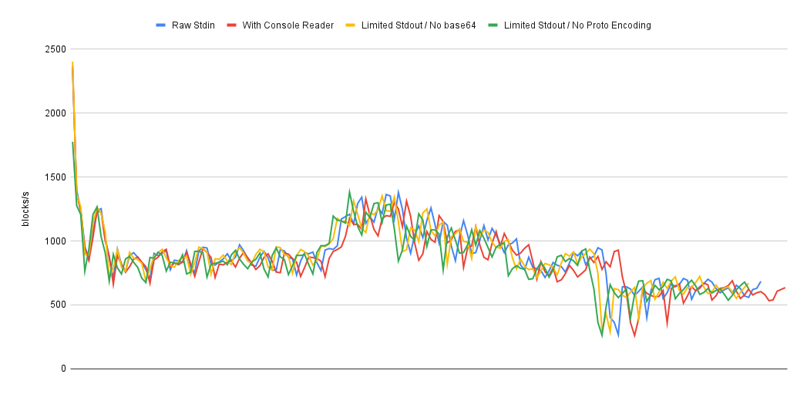
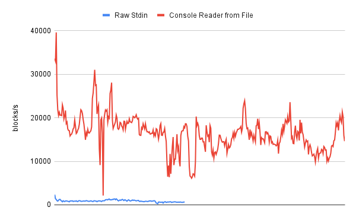

## Syncing Speed Experiments & Results

This document contains instructions and results about some experiments recently done around `aptos-node` and `firehose-aptos` syncing together.

### `aptos-node` outputs to `stdout` piped into and read by a "raw" Go

In this setup, we want to see what is the throughput of `aptos-node` while it stream everything to a Go program. This Go program reads the input, scan each line of it (splitting by `\n` character) and discard it mostly right away.  Only processing is to extract the current block number from the `FIRE BLOCK_END <BLOCK_NUM>` line and increase some counters. Each 1s a print of the counters is printed.

This is the maximum throughput we can hope to get in the current state, it does not involve any decoding nor storage of anything.

Configuration of `aptos-node`:
- Commit [08e7ae493efe0ef5ce5bfa467668db4cbc934c39](https://github.com/aptos-labs/aptos-core/commit/08e7ae493efe0ef5ce5bfa467668db4cbc934c39)
- Compiled with `RUSTFLAGS="-L /opt/homebrew/opt/postgresql/lib --cfg tokio_unstable" cargo build -p aptos-node --release`
- Pre-populated `devnet` instance RocksDB up to block ~1,100,000.

Configuration of `firehose-aptos`:
- Commit [0745db35507bb321ae36adf015862d37dda2f989](https://github.com/streamingfast/firehose-aptos/commit/0745db35507bb321ae36adf015862d37dda2f989)

Invocation:

```
RUST_LOG=error STARTING_BLOCK=0 aptos-node --config /Users/maoueh/work/sf/firehose-aptos/devel/devnet/firehose-data/extractor/data/node.yaml 2>&1 | go run ./codec/bench "-" rawStdin | tee codec/bench/results_raw_stdin.log
```

We let it run until it reaches approximately block #150,000 at which point we do a `Ctrl-C`.

Quick statistics about the run:

```
$ cat codec/bench/results_raw_stdin.log| cut -d ' ' -f 4 | stats
Count: 170
Range: Min 267 - Max 2343
Sum: 150280
Average: 884
Median: 872
Standard Deviation: 238.16
```

> Graphs presented later

### `aptos-node` outputs to `stdout` piped into and "console reader" Go

In this test, the differences is that we are now exercising the `console_reader.go` part of the equation which received read lines if they start with prefix `FIRE`. This means that we now added fully decoding of each line, base64 and Protobuf decoding as well as creating the final `pbaptos.Block` content and serialized it in a `bstream.Block` which contains a serialized version of the `pbaptos.Block`.

```
RUST_LOG=error STARTING_BLOCK=0 aptos-node --config /Users/maoueh/work/sf/firehose-aptos/devel/devnet/firehose-data/extractor/data/node.yaml 2>&1 | go run ./codec/bench "-" blocksStdin | tee codec/bench/results_blocks_stdin.log
```

```
$ cat codec/bench/results_blocks_stdin.log|cut -d ' ' -f 4 | stats
Count: 176
Range: Min 261 - Max 2366
Sum: 149536
Average: 849
Median: 839
Standard Deviation: 232.65
```

There is no differences when introducing `Console Reader` so the bottleneck here is in `aptos-node` part.

### `aptos-node` outputs only `FIRE BLOCK_END` (proto encoding but no `base64` encoding) to `stdout` piped into and read by a "raw" Go

In this mode, we check what is the difference if we print almost no information to `stdout` and eliminate also the `base64` encoding. In this setup, we tweaked `aptos-node` to perform `println!("FIRE BLOCK_END {}", ...)` call only, all others specially transaction are not printing anything.

The Protobuf encoding of the transaction is still involved (we made sure also it's not removed by a compiler optimization).

> Since we are effectively breaking the message format, only "raw" stdin test can be run, the `blocks stdin` one cannot run because it fails right away because of wrongly received message

```
RUST_LOG=error STARTING_BLOCK=0 aptos-node --config /Users/maoueh/work/sf/firehose-aptos/devel/devnet/firehose-data/extractor/data/node.yaml 2>&1 | go run ./codec/bench "-" rawStdin | tee codec/bench/results_raw_stdin_tiny_output_no_base64.log
```

```
$ cat codec/bench/results_raw_stdin_tiny_output_no_base64.log|cut -d ' ' -f 4 | stats
Count: 167
Range: Min 291 - Max 2401
Sum: 147570
Average: 883
Median: 878
Standard Deviation: 238.52
```

### `aptos-node` outputs only `FIRE BLOCK_END` (no proto encoding, no base64) to `stdout` piped into and read by a "raw" Go

Same as previous [section](#aptos-node-outputs-only-fire-blockend-proto-encoding-but-no-base64-encoding-to-stdout-piped-into-and-read-by-a-raw-go) but now we have remove also the Protobuf encoding to bytes array.

The construction of the Protobuf structure is still performed but it's serialization to bytes is not done.

```
RUST_LOG=error STARTING_BLOCK=0 aptos-node --config /Users/maoueh/work/sf/firehose-aptos/devel/devnet/firehose-data/extractor/data/node.yaml 2>&1 | go run ./codec/bench "-" rawStdin | tee codec/bench/results_raw_stdin_tiny_output_no_proto_encoding.log
```

```
$ cat codec/bench/results_raw_stdin_tiny_output_no_proto_encoding.log| cut -d ' ' -f 4 | stats
Count: 167
Range: Min 263 - Max 1775
Sum: 142978
Average: 856
Median: 842
Standard Deviation: 216.38
```

### Theoretical "console reader" Go throughput

What is the actual maximum throughput we can get from `Console Reader` itself. Again, it must be emphasis here it's not the full system, just the feeding + reading part directly, without any intermediary in between. It's not the actual maximum throughput of the system.

To achieve this experiment, we first created a 140 GB file by extracting `FIRE` logs line from `aptos-node` itself with:

```
RUST_LOG=error STARTING_BLOCK=0 aptos-node --config /Users/maoueh/work/sf/firehose-aptos/devel/devnet/firehose-data/extractor/data/node.yaml | grep -E "^FIRE" > /tmp/devnet-from-block-0.firelog
```

And let it run for a few hours.

Then we ran the experiment with:

```
cat ~/Downloads/devnet-from-0.firelog | go run ./codec/bench "-" blocksStdin | tee ./codec/bench/results_blocks_stdin_from_premade_file.log
```

> We removed the last line of the file because it is `Completed` and we can disregard it.

And here the stats:

```
$ cat codec/bench/results_blocks_stdin_from_premade_file.log | cut -d ' ' -f 4 | stats
Count: 378
Range: Min 2149 - Max 39636
Sum: 6232643
Average: 16488
Median: 16574
Standard Deviation: 4205.23
```

### Full System Throughput

Now, let's see how the full system performs exactly, again we a pre-populated `devnet` database.

We first clean up any firehose aptos storage element to ensure we are "clean":

```
rm -rf ./devel/devnet/firehose-data/storage && rm -rf ./devel/devnet/firehose-data/localdata && rm -rf ./devel/devnet/firehose-data/extractor/work/uploadable-oneblock && printf '{"last_seen_block_num":0}' > ./devel/devnet/firehose-data/extractor/work/sync_state.json
```

Then we can start it:

```
DLOG=".*=-,extractor.*=info" RUST_LOG=error ./devel/devnet/start.sh -- --log-format=stackdriver 2>&1 | grep --line-buffered "extractor read statistics" | tee codec/bench/results_full_system.log
```

We let it run to gather around 200 lines of output (which is around how many samples we collected for the other tests). And the stats of the run:

```
$ cat ./codec/bench/results_full_system.log | jq -r .block_rate | cut -d ' ' -f 1 | stats
Count: 184
Range: Min 23.00000 - Max 142.00000
Sum: 6786.00000
Average: 36.88043
Median: 38.00000
Standard Deviation: 9.01770
```

### Analysis

#### Raw `aptos-node` throughput

Let's start with the graph that lists the 4 `aptos-node` experiments:

- [Raw Stdin](#aptos-node-outputs-to-stdout-piped-into-and-read-by-a-raw-go)
- [With Console Reader](#aptos-node-outputs-to-stdout-piped-into-and-console-reader-go)
- [Limited Stdout / No base64](#aptos-node-outputs-only-fire-blockend-proto-encoding-but-no-base64-encoding-to-stdout-piped-into-and-read-by-a-raw-go)
- [Limited Stdout / No Proto Encoding](#aptos-node-outputs-only-fire-blockend-no-proto-encoding-no-base64-to-stdout-piped-into-and-read-by-a-raw-go)



As we can see in the graph, there is no overall differences in the four experiments. So `console reader` processing has no impact on sync speed nor disable most of `stdout` output on `aptos-node` side nor removing the `base64` and Protobuf encoding.

#### Theoretical "console reader" Go throughput

We can see with this example what is theoretical throughput we can get, which is quite massive in respect to what currently `aptos-node` can feed us. In average we get `16488 blocks/`



#### Full system


